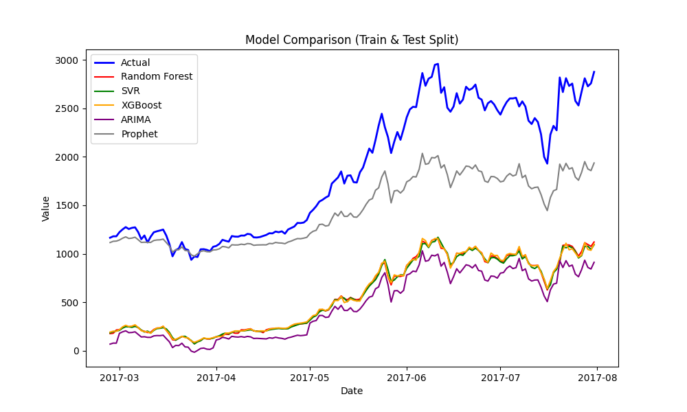
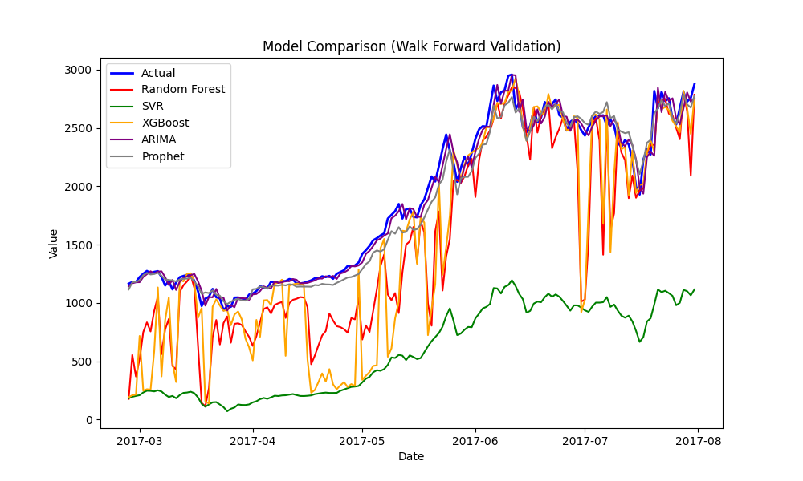

# Bitcoin Price Prediction

## Project Overview

This project aims to predict the price of Bitcoin using the following machine learning models:
- Random Forest
- Support Vector Machine
- XGBoost
- ARIMA
- Prophet
  
The dataset used in this project is the Kaggle dataset [Bitcoin Price Prediction (LightWeight CSV)](https://www.kaggle.com/datasets/team-ai/bitcoin-price-prediction)

## Table of Contents

- [Folder Structure](#folder-structure)
- [Results](#results)
- [Building](#building)
- [License](#license)


## Folder Structure

```plaintext
Bitcoin-Price-Prediction/
│
├── data/
│   ├── case_study_1/
│   │   ├── processed/
│   │   └── raw/
│
├── src/
│   ├── case_study_1/
│   │   ├── model/
│   │   │   ├── arima_functions.py
│   │   │   ├── cross_validation.py
│   │   │   ├── model_evaluation.py
│   │   │   ├── prophet_functions.py
│   │   │   └── walk_forward_validation.py
│   │   ├── preprocessing/
│   │   │   ├── data_cleaning.py
│   │   │   ├── data_preprocessing.py
│   │   │   └── training_models.py
│   │   └── train_evaluate.py
│   │   └── visualization.py
│
├── graphs/
│   ├── case_study_1/
│   │   ├── results/
│   │   │   ├── train_test_split.png
│   │   │   ├── walk_forward_val.png
|
└── config.yaml
└── .gitignore
└── .requirements.txt

```

## Results

The performance of each model is evaluated using multiple metrics and recorded as graphs in graphs/.

### Case Study 1

#### Train, Test Split

<table>
  <tr>
    <td>
      <table>
        <thead>
          <tr>
            <th>Model</th>
            <th>R²</th>
            <th>MAPE</th>
            <th>MAE</th>
            <th>MSE</th>
          </tr>
        </thead>
        <tbody>
          <tr>
            <td>Prophet</td>
            <td>0.368</td>
            <td>18.449</td>
            <td>413.669</td>
            <td>273712.588</td>
          </tr>
          <tr>
            <td>XGBoost</td>
            <td>-2.975</td>
            <td>72.076</td>
            <td>1278.652</td>
            <td>1722022.791</td>
          </tr>
          <tr>
            <td>Random Forest</td>
            <td>-2.990</td>
            <td>72.251</td>
            <td>1281.341</td>
            <td>1728594.680</td>
          </tr>
          <tr>
            <td>SVR</td>
            <td>-3.020</td>
            <td>72.415</td>
            <td>1285.417</td>
            <td>1741651.876</td>
          </tr>
          <tr>
            <td>ARIMA</td>
            <td>-3.761</td>
            <td>78.558</td>
            <td>1397.157</td>
            <td>2062608.181</td>
          </tr>
        </tbody>
      </table>
    </td>
    <td>
      
    </td>
  </tr>
</table>


### Time Series Cross Validation

| Model         | R²     | MAPE   | MAE      | MSE        |
|---------------|--------|--------|----------|------------|
| Prophet       | 0.812  | 0.068  | 97.419   | 74429.202  |
| SVR           | 0.539  | 0.109  | 164.893  | 211204.798 |
| Random Forest | 0.527  | 0.117  | 168.765  | 206776.694 |
| XGBoost       | 0.469  | 0.131  | 176.450  | 216565.162 |
| ARIMAX        | 0.022  | 0.182  | 202.285  | 236345.004 |

### Walk Forward Validation

<table>
  <tr>
    <td>
      <table>
        <thead>
          <tr>
            <th>Model</th>
            <th>R²</th>
            <th>MAPE</th>
            <th>MAE</th>
            <th>MSE</th>
          </tr>
        </thead>
        <tbody>
          <tr>
            <td>ARIMA</td>
            <td>0.979</td>
            <td>0.033</td>
            <td>64.540</td>
            <td>9058.215</td>
          </tr>
          <tr>
            <td>Prophet</td>
            <td>0.977</td>
            <td>0.041</td>
            <td>76.843</td>
            <td>10018.735</td>
          </tr>
          <tr>
            <td>Random Forest</td>
            <td>0.510</td>
            <td>0.221</td>
            <td>343.099</td>
            <td>212202.610</td>
          </tr>
          <tr>
            <td>XGBoost</td>
            <td>0.281</td>
            <td>0.248</td>
            <td>374.083</td>
            <td>311696.006</td>
          </tr>
          <tr>
            <td>SVR</td>
            <td>-2.937</td>
            <td>0.719</td>
            <td>1273.542</td>
            <td>1705706.596</td>
          </tr>
        </tbody>
      </table>
    </td>
    <td>
      
    </td>
  </tr>
</table>


## Building

### Prerequisites
Before building the project, ensure you have Python installed

### Installation

1. **Clone the Repository**:

   Clone the repository to your local machine using the following command:
   
   `git clone https://github.com/RamezzE/Bitcoin-Price-Prediction.git`

2. **Navigate to project folder**

   `cd Bitcoin-Price-Prediction`

3. **Create & activate virtual environment** (Optional but recommended)

    `python -m venv venv`

     `venv\Scripts\activate`
   
4. **Install required packages**

    `pip install -r requirements.txt`

5. **Run main file to clean & preprocess data then train models and view results**

    `python src\case_study_1\train_evaluate.py`

## License 

This project is licensed under the [MIT License](LICENSE).
